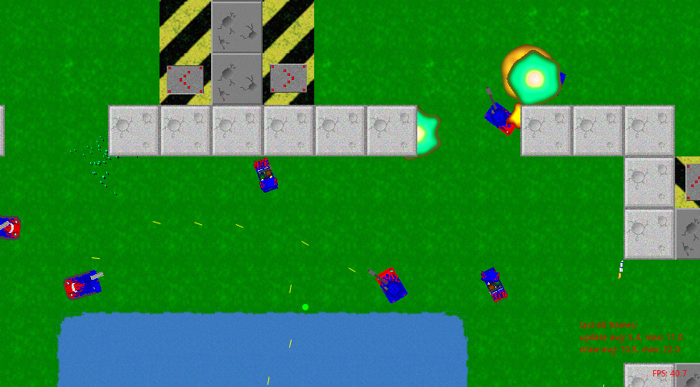

<div align="center">
    <h1>RecWars</h1>
    <i>Recreational Warfare .rs</i>
    <br />
    A multiplayer top-down tank shooter - Rust/WASM port of an old Windows game called RecWar.
</div>
<br />

[](https://github.com/martin-t/rec-wars)
[](https://github.com/martin-t/cvarec-warsrs/blob/master/LICENSE)
[](https://github.com/martin-t/rec-wars/actions)
[](https://rustsec.org/)
[](https://deps.rs/repo/github/martin-t/rec-wars)
[](https://discord.gg/9BQVVgV)
<!-- These keep getting broken and then they show 0 which looks bad, comment out when that happens. -->
[](https://github.com/martin-t/rec-wars)
[](https://github.com/martin-t/rec-wars#architecture-overview)

<!-- Note to my future OCD: The ideal image width for a github readme is ~838~ 830 pixels. Inspect in firefox and look at Box Model on the Layout tab (value confirmed in gimp). The recommended size for the social preview is higher, likely best to use a different image. -->
<!-- Check https://github.com/topics/multiplayer-browser-game to make sure it doesnẗ look blurry. -->
[](https://martin-t.gitlab.io/gitlab-pages/rec-wars/macroquad.html)

_**[Play in the Browser](https://martin-t.gitlab.io/gitlab-pages/rec-wars/macroquad.html)** | **[Join our Discord](https://discord.gg/9BQVVgV)**_

RecWars is a free and open source clone of [RecWar](#the-original-game) - you control a vehicle and fight other vehicles in a variety of game modes using an arsenal of several distinct weapons. You can play against bots, in splitscreen and over the network.

RecWars aims to have gameplay similar, but not identical, to RecWar. I suspect RecWar was balanced for playing against bots and might result in annoying strats being the most effective when people start [playing to win](http://www.sirlin.net/articles/playing-to-win). However, almost everything in RecWars is [configurable](#cvars) and you can switch to the original RecWar balance to [compare](#recwars-vs-recwar-differences).

**Currently this is very much a work-in-progress**: the driving physics don't feel right, there are no collisions between vehicles, bots move randomly ...

The ultimate goal is to create a moddable multiplayer game playable in the browser and natively on Linux, Windows and macOS. RecWars is built in the spirit of [everlasting games](https://spicylobster.itch.io/jumpy/devlog/337996/everlasting-games).

(Planned) Features
------------------

- [x] Singleplayer
- [ ] Multiplayer
    - [x] Splitscreen
    - [ ] Network
- [ ] Bot AI
- [x] [Browser client](https://martin-t.gitlab.io/gitlab-pages/rec-wars/macroquad.html)
- [x] Native client (Linux, Windows, macOS)
- [ ] Game modes
    - [x] Free For All
    - [ ] Team War
    - [ ] Capture The Cow
- [x] [Highly configurable](#cvars)

See [TODO.md](TODO.md) for details.

Build Dependencies
------------------

Install [Macroquad's dependencies](https://github.com/not-fl3/macroquad#linux).

Compiling and running
---------------------

### Native version

How to run:
- `cargo run`

You can set [cvars](#cvars) on the command line - e.g.:
- `cargo run -- g_map Atrium g_armor 150`

### Browser version

This version is hosted [here](https://martin-t.gitlab.io/gitlab-pages/rec-wars/macroquad.html).

How to run locally:

- Build with `cargo build --target wasm32-unknown-unknown && mv target/wasm32-unknown-unknown/debug/rec-wars.wasm rec-wars.wasm`
    - You can use `--release` to get better perf and a much smaller WASM file.
- Host with `python3 -m http.server` (or any other web server, simply opening `macroquad.html` will *not* work though).
- Open http://localhost:8000/macroquad.html.

Contributing
------------

You can always find me on the [RecWars Discord server](https://discord.gg/9BQVVgV) if you have any questions or suggestions.

[Issues](https://github.com/martin-t/rec-wars/issues/new) and [Pull Requests](https://github.com/martin-t/rec-wars/pulls) are welcome, I will try to look at them as soon as possible.

I want to make RecWars highly configurable with many different gamemodes and balance settings votable by players and anybody will be able to host their own server (if technically possible, then even from the browser). If you have a gameplay idea and don't suffer from the NIH syndrome, I'd be very happy to help you test it in RecWars.

### Tips (Optional)

Enable extra checks before every commit: copy/symlink `pre-commit-example` to `pre-commit` and run `git config core.hooksPath git-hooks`. It gets checked on CI anyway, this just catches issues faster.

Enable fast builds - see [.cargo/config-example.toml](.cargo/config-example.toml) for details.

For slightly faster builds, prevent rust-analyzer from locking the `target` directory. Add this to your VSCode config (or something similar for your editor):
```json
"rust-analyzer.server.extraEnv": {
    "CARGO_TARGET_DIR": "target-ra"
}
```
Normally, rust-analyzer runs `cargo check` on save which locks `target` so if you switch to a terminal and do `cargo run`, it blocks the build for over a second which is currently a third of the build time. This will make rust-analyzer make use a separate target directory so that it'll never block a build (at the expense of some disk space). Alternatively, you could disable saving when losing focus, disable running check on save or use the terminal inside VSCode.

Architecture Overview
---------------------

Most of the code is commented to be understandable to anyone with a vague idea of how a game works. If it's not clear why a particular piece of code exists or why it needs to be written the way it is, I consider that a bug which should be fixed by either rewriting the code more clearly or adding comments explaining it.

Currently, most game state is managed by generational arenas from the [thunderdome](https://github.com/LPGhatguy/thunderdome) crate to make the code type-safe and readable. Previously, RecWars used the [legion](https://github.com/amethyst/legion) ECS. However it was cumbersome to use and WASM didn't get any benefits from parallelism. The only reason I was using ECS was so I could have references between entities and for this I was paying by having all entities dynamicly typed which lead to bugs. It's a Rust tradition to start writing a game and end up writing a game engine or ECS so I am considering creating an ECS crate that would satisfy my standards of clean API and static typing. For now arenas seem to be close enough.

The code is currently all in a single crate. It used to be split into a lib (gamelogic) and bin (rendering) but this builds faster.

Cvars
-----

Cvars are *console variables* - configuration settings which control everything in the game like physics, weapon behavior, AI, HUD layout, etc.

They use the [cvars](https://crates.io/crates/cvars) crate - an alternative to `inline_tweak` & friends. There's a built-in console from the `cvars-console-macroquad` crate.

### Changing cvars

- Press ";" or "\`" to open the console
- Type the cvar's name and new value - e.g. `g_bfg_beam_range 250`

The desktop version also accepts them on the command line. Some cvars like `g_map` or `d_seed` currently only take effect this way because they need to be set before match start.

The entire list of cvars is in [src/cvars.rs](src/cvars.rs).

The Original Game
-----------------

RecWar by Willem Janssen:
- homepage: http://recreationalwarfare.atspace.com/index_willem.html (the game's download is broken but still hosts extra maps)
- unofficial homepage: http://www.recwar.50webs.com/
- archive.org download: https://archive.org/details/recwar_201903
- archive.org download with extra maps: https://archive.org/details/RecWar

The original RecWar only contains a Windows .exe but runs ok-ish wine (sometimes freezes on map load). It includes a map editor. The binaries in both archive.org links are identical to what I got on an old CD so should be safe.

### RecWars vs RecWar differences

RecWar would probably be impossible to replicate exactly without decompiling the binary (which doesn't even contain debug symbols), though if a fan of the original finds this project, I am not gonna stop them from trying.

Additionally, when playing against people instead of bots, I suspect RecWar's original balance would lead to annoying and boring strats like making the cow inaccessible with mines or just simple camping. For example, experience from poorly designed games shows large areas will be dominated by instant-hit weapons (in RecWar the railgun) and there might simply be no way to get across the map alive. Therefore I made the railgun a very fast projectile in RecWars. I might make more balance changes based on how the online gameplay evolves.

For those reasons, RecWars will have a slightly different balance than RecWar. I will try to keep them as similar as possible but some things like physics will never be exact and I will make changes where I see fit to make the gameplay more interesting.

Intentional differences (can be toggled by switching the balance):
- Railgun - RecWar railgun hits instantly, RecWars uses a very fast projectile because hitscan weapons ruin large maps

Unintentional differences - I will make best effort here but some things won't be exact:
- Speeds, accelerations, turning, inertia of vehicles and weapons
- Push force of mines and railguns
- Tank in RecWar turned around turret swivel point, not center of chassis - this is for simplicity for now
- Weapons
    - Damage - Cluster bomb and BFG beam are hard to measure exactly
    - Spreads - Cluster bombs and MG are hard to measure exactly
- Self destruct damage and range - it appears to be the only explosion in RecWar with damage decreasing by distance and it's really hard to measure exactly.

Maps
----

- `maps/` - Maps from the original RecWar
- `maps/extra/` - Extra maps from the official homepage
- `maps/extra2/` - Extra maps from archive.org

Currently the map is picked randomly by default, however, in the desktop version you can choose it manually on the command line.

Lessons Learned
---------------

Read this to learn from other people's mistakes and save yourself some time.

- RecWars originally drew to an HTML canvas directly without an engine. It turned out to provide no benefits over just using an engine and the raw canvas version has since been removed. The current version uses macroquad, which takes care of building WASM and talking to the browser. The raw canvas version has, however, taught me a bit about compiling Rust to WASM and the `wasm-pack` tooling:
    - It's possible and advisable to use WASM without NPM. The official [Rust+WASM book](https://rustwasm.github.io/docs/book/) heavily pushes people towards NPM and the whole thing feels like "just download this big template, don't try to understand it and only touch the parts we tell you to". Honestly how do you even statically host the thing on GH/GL pages without `npm run`?. If you're not planning to use other NPM packages, all you need is a few lines of JS glue to run your WASM. Use the [Without a Bundler](https://rustwasm.github.io/docs/wasm-bindgen/examples/without-a-bundler.html) example as your "template" and host it with `python3 -m http.server`. You'll understand exactly what is going on and you'll avoid the whole JS ecosystem.
- ~~The canvas 2D API is too slow for a game which needs to redraw the entire screen each frame, especially in firefox.~~ ~~UPDATE 2021-02-16: HTML canvas in firefox on linux is too slow. Probably nothing I can do about it until [this bug](https://bugzilla.mozilla.org/show_bug.cgi?id=1010527#c0) is resolved. Quote: "AFAIK Chrome does use it, but they also maintain a long list of driver bug workarounds - too much to handle for the FF team.". In short, again, blame incompetent driver devs - C(++) rockstars like them can't be bothered with stuff like tests, [basic](https://gitlab.freedesktop.org/mesa/mesa/-/commit/69e6eab6533ff48f72223cd21ef640242c52598b) static analysis or sanitizers - they killed [glium](https://users.rust-lang.org/t/glium-post-mortem/7063), they're killing firefox on linux.~~ UPDATE 2023-07-11: Performance in Firefox is now OK. People who don't use readily available tools for checking correctness still shouldn't call themselves engineers.
- ECS is overhyped. It will make all your game entities dynamicly typed but with much more boilerplate than a dynlang and will predictably lead to bugs. If you don't need to add/remove components at runtime, the only reason you're using it is probably so you can have references between entities - just use generational arenas. Appeal to authority: [rg3d](https://rg3d.rs/) is written by an experienced game engine dev and avoids ECS for much the same reason.
- Generational arenas will lead to slightly more borrowck errors. ECS either avoided them implicitly by borrowing only parts of the gamestate (runtime borrowchecking) or resolved them explicitly by postponing mutation (e.g. legion's [`CommandBuffer`](https://docs.rs/legion/*/legion/systems/struct.CommandBuffer.html)). With arenas, you have to deal with them explicitly more often:
    - You can't add to / remove from an arena while iterating through it
        - Use specialized methods like `retain` if available
        - Avoid borrowing the whole arena in a loop - instead, collect handles into a vector, iterate through that vector and borrow only for parts of the loop body
        - Collect entities to add / handles to remove into a vector, add / remove after the loop is done
    - Subfunctions need mutable game state while you're iterating through one of the arenas
        - Be more granular - don't pass them the entire game state, just the arenas it needs
        - Again, collect handles, iterate through them, reborrow each iteration, end borrow before calling subfunctions

License
-------

<!-- When updating this, also update LICENSE and Cargo.toml -->
All code is available under [AGPL-v3](agpl-3.0.txt) or newer.

All assets (maps, textures, sounds, etc.) are taken from the original RecWar by Willem Janssen which is freely available online.
